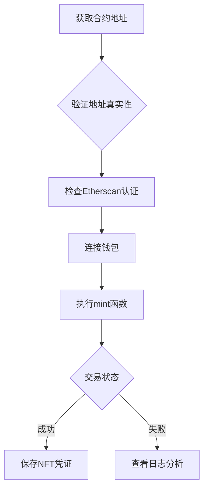

# NFT抢购失败怎么办？智能合约mint操作全攻略

在NFT热潮中，抢购热门项目常因平台拥堵导致失败。本文详解通过智能合约直接mint的进阶玩法，助您突破传统抢购瓶颈。掌握这项技能前，建议先了解[以太坊钱包基础教程](https://bit.ly/okx_welcome)，确保操作安全。

## 为什么需要智能合约mint？

当热门NFT项目开启公售时，官方平台常因访问量激增而崩溃。数据显示，2023年Top 100 NFT项目中，78%出现过mint高峰期平台宕机情况。此时通过智能合约直接交互，可绕过中心化平台限制，实现去中心化铸造。

## 操作流程详解

### 准备阶段

1. **获取合约地址**
   - 官方渠道获取最可靠
   - Opensea平台NFT详情页可查
   - 开发者社群公告为准

2. **验证地址安全性**
   - 检查Etherscan认证状态
   - 核对开发者公开地址
   - 参考Discord社群公告

### 操作步骤

#### Step 1: 访问Etherscan合约页面
👉 [快速定位合约地址工具](https://bit.ly/okx_welcome)
1. 打开[Etherscan.io](https://etherscan.io/)
2. 粘贴合约地址
3. 确认项目名称与开发者信息

#### Step 2: 交互准备
| 操作项          | 注意事项                  |
|-----------------|---------------------------|
| 钱包连接        | MetaMask/Trust Wallet等   |
| ETH余额         | 需预留至少0.1 ETH手续费   |
| Gas设置         | 建议开启120 Gwei以上      |

#### Step 3: 执行mint操作
1. 进入合约页面"Write Contract"选项卡
2. 找到mint函数（常见名称：mint, publicMint）
3. 填写数量参数（注意单位换算）
4. 计算总金额（单价×数量+Gas费）
5. 确认交易详情后提交

## 关键参数对照表

| 参数类型       | 推荐设置             | 风险提示               |
|----------------|----------------------|------------------------|
| Gas Price      | 100-150 Gwei         | 过低导致交易卡顿       |
| Gas Limit      | 250,000-500,000      | 不足将消耗全额手续费   |
| Max Fee        | 实时网络价格+10%     | 动态调整更安全         |
| Priority Fee   | 建议≥2 Gwei          | 影响交易优先级         |

## 常见问题解答

**Q：合约交互提示"Reverted"是什么原因？**
A：常见于合约未开放mint或参数错误。建议检查：
1. 项目公售时间
2. 钱包地址白名单状态
3. 参数填写格式（如16进制/十进制）

**Q：Gas费如何动态优化？**
A：使用EthGasStation等工具实时监控网络拥堵情况，高峰期建议：
- 基础费：实时价格+30%
- 优先费：2-5 Gwei
- 总预算=（基础费+优先费）×Gas Limit

**Q：交易失败会损失手续费吗？**
A：是的。若因Gas不足导致失败，已消耗手续费不可退回。建议：
1. 首次操作小额测试
2. 查看合约交易历史
3. 使用Gas估算工具

**Q：如何验证合约安全性？**
A：三重验证法：
1. Etherscan代码验证状态
2. 开发者Discord公告
3. 区块链安全公司审计报告

**Q：多签钱包如何操作？**
A：需特别注意：
- 确认多签阈值设置
- 保存交易哈希备份
- 使用Safe{Wallet}等专业工具

## 进阶技巧

### Gas优化策略
👉 [实时Gas价格监控工具](https://bit.ly/okx_welcome)
1. 使用Flashbots防止被抢跑
2. 批量mint降低单位成本
3. 选择网络低峰期操作

### 失败应急方案
当遇到合约交互失败时：
1. 检查区块确认数（建议≥12）
2. 尝试提高Gas价格重发
3. 联系开发者获取ABI参数

### 风险防控
1. 设置交易金额上限
2. 启用钱包二次验证
3. 定期更新助记词

## 安全操作流程

通过智能合约直接mint，不仅能突破平台限制，更是理解区块链底层交互的关键技能。建议新手先通过测试网（如Rinkeby）模拟操作，熟练后再进行真实环境交易。记得定期关注[区块链安全指南](https://bit.ly/okx_welcome)，掌握最新防护技巧。

👉 [立即体验专业NFT钱包服务](https://bit.ly/okx_welcome)