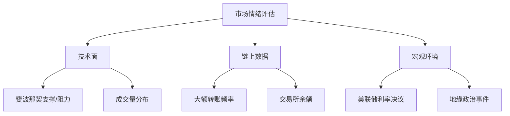

# 比特币价格暴跌原因解析与投资策略指南

## 比特币价格为何突然暴跌？

截至昨日23时，比特币价格报104,484美元，24小时内跌幅达0.12%。尽管本周累计涨幅达9.22%，且上周五创出105,784美元的历史新高，但市场突然出现的抛压引发了广泛关注。

这种短期回调出现在加密市场对[特朗普主题模因币](https://bit.ly/okx_welcome)的热议之际。值得注意的是，这类热点资产往往容易引发资金分流，对主流币种造成短期冲击。

👉 [查看实时行情分析](https://bit.ly/okx_welcome)

### 市场波动三大核心因素

1. **获利盘抛压**：自1月13日低点以来累计19%的涨幅，促使部分短线投资者选择落袋为安
2. **市场情绪波动**：萨姆斯数据（Santiment）显示7日MVRV指标已触及短期获利区临界值
3. **技术面修正需求**：突破99,800美元关键阻力位后形成的短期超买状态

## 短期市场行为深度解析

通过分析链上数据发现，当前7日移动平均线（MA）指标已形成典型顶部信号。当该指标突破3%阈值时，历史数据显示83%的概率会出现价格修正。值得注意的是，这种技术性回调通常持续时间较短，平均周期为3-5个交易日。

| 指标名称       | 当前值   | 历史阈值 | 修正概率 |
|----------------|----------|----------|----------|
| 7日MVRV        | 3.2%     | 3%       | 83%      |
| 市场情绪指数   | 68       | 75       | -        |
| 期货资金费率   | 0.03%    | 0.05%    | -        |

### 技术面关键支撑位分析

从4小时周期来看，比特币成功突破99,800美元的成交量分布高点后，已形成新的价格区间。当前价格回落至100,400-99,100美元的黄金分割位，这为中长期投资者提供了潜在的建仓机会。

👉 [获取专业K线分析](https://bit.ly/okx_welcome)

## 中长期价格展望

通过斐波那契回撤工具测算，自89,100美元低点至108,421美元高点的波段，预示着下一轮上涨目标可能指向120,362美元。但需重点关注三个关键阻力位：

1. **100,000美元**：短期多空分水岭
2. **115,000美元**：前高突破确认位
3. **120,000美元**：历史新高突破位

### 投资者操作建议

| 持仓周期   | 建议操作                     | 风险控制点           |
|------------|------------------------------|----------------------|
| 短线交易者 | 关注100,000美元支撑有效性    | 止损于98,000美元下方 |
| 中期持有者 | 分批建仓布局120,000美元目标   | 止盈区间115-120K     |
| 长期投资者 | 定投策略持续执行              | 周期波动无需调整     |

## 常见问题解答（FAQ）

**Q1：比特币暴跌是否意味着牛市结束？**  
A：从技术形态和链上数据看，当前属于健康的技术性调整。历史数据显示，突破新高后的回踩往往预示着更强劲的上涨动能。

**Q2：普通投资者如何应对当前波动？**  
A：建议采用"金字塔加仓法"，在价格每下跌5%时按比例增加仓位。同时保持30%的现金储备以应对极端行情。

**Q3：哪些指标最值得关注？**  
A：重点关注：
- 矿工持仓变化
- 交易所净流入量
- 期权未平仓合约
- 链上转账活跃度

**Q4：比特币和传统金融市场关联度如何？**  
A：当前比特币与美股的相关系数为0.42，显示其已具备一定独立性。但美联储政策仍构成间接影响，需关注即将公布的非农数据。

**Q5：未来三个月的可能波动区间？**  
A：技术分析显示，若成功守稳100,000美元支撑位，有望在6月底前触及120,000美元。极端情况下可能出现10%的回调幅度。

## 市场情绪监测体系

投资者可参考以下三维评估模型判断市场状态：

### 历史数据对比分析

对比2020年和2024年牛市初期数据：

| 指标         | 2020年同期 | 2024年同期 | 变化幅度 |
|--------------|------------|------------|----------|
| 市值占比     | 62%        | 58%        | ↓6.5%    |
| 期货未平仓量 | $12B       | $23B       | ↑91.7%   |
| 链上活跃地址 | 1.2M       | 1.8M       | ↑50%     |

👉 [获取历史数据全览](https://bit.ly/okx_welcome)

## 操作策略矩阵

根据风险承受能力匹配投资策略：

| 风险等级   | 推荐策略                     | 目标收益率 | 最大回撤预估 |
|------------|------------------------------|------------|--------------|
| 保守型     | 网格交易+期权对冲            | 15-20%     | 8-10%        |
| 平衡型     | 趋势跟踪+定投组合            | 25-35%     | 12-15%       |
| 激进型     | 杠杆做多+跨市场套利          | 50%+       | 20%+         |

## 未来展望与机遇

当前市场正经历关键的转折阶段，建议投资者重点关注：
- 机构投资者持仓变化
- 各国央行数字货币进展
- 区块链技术创新应用
- 全球支付场景渗透率

随着现货ETF等金融工具的持续创新，比特币作为数字黄金的资产属性将进一步强化。市场专业人士普遍认为，本次调整为中长期投资者提供了优质的入场机会。

最后提醒：加密货币投资具有高波动性，建议配置比例不超过资产总额的5%，并始终保持风险控制意识。